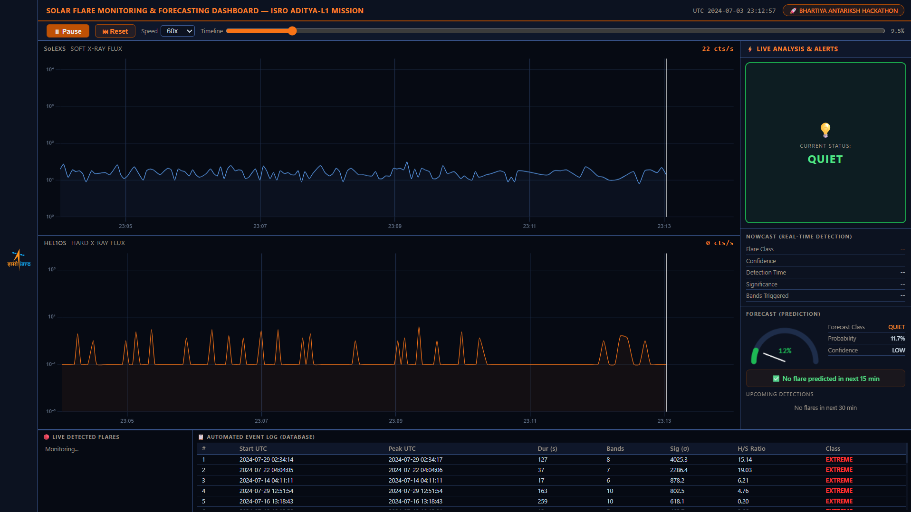

# Aditya-L1 Solar Flare Nowcasting & Forecasting

> **ISRO Bhartiya Antariksh Hackathon 2026 | Problem Statement 15**

> ⚠️ Full source code will be made public after the ISRO Bhartiya Antariksh Hackathon 2026.

---

## What is This Project?

Solar flares are sudden bursts of radiation from the Sun that disrupt satellite communications, GPS navigation, and power grids worldwide. Early warning systems can give operators critical time to protect infrastructure.

**SolarSentinel** is a real-time solar flare detection and prediction system built on data from ISRO's **Aditya-L1** — India's first dedicated solar observation satellite. It combines a physics-based detection pipeline with a deep learning forecasting model and a live monitoring dashboard.

---

## Live Dashboard Preview



> *Real-time replay of July 2024 Aditya-L1 data showing SoLEXS soft X-ray and HEL1OS hard X-ray flux with live nowcast alerts and ML forecast probability.*

---

## Key Features

| Feature | Description |
|---|---|
| **Multi-band Detection** | Processes 10 energy bands from HEL1OS (10–150 keV) + SoLEXS (1–30 keV) |
| **Physics-based Pipeline** | 5-sigma Poisson significance filter + FRED morphological shape validation |
| **LSTM Forecasting** | Deep learning model predicts flare probability 5–15 min ahead |
| **Dynamic Lead Time** | Alert fires earlier as probability rises — not a fixed window |
| **Live Dashboard** | Smooth Chart.js graphs, glowing alert system, rolling prediction cards |
| **REST API Backend** | FastAPI server with 6 endpoints for real-time data streaming |
| **Automated Event Log** | Detected flares logged with timestamp, significance, and severity class |

---

## System Architecture

```
ISRO PRADAN Portal (Aditya-L1 Level-1 FITS Data)
              ↓
    ┌─────────────────────────┐
    │   Data Ingestion Layer  │  Astropy FITS parser
    │   (23 columns, 3.5M rows│  Multi-band alignment
    └────────────┬────────────┘
                 ↓
    ┌─────────────────────────┐
    │  Statistical Triggering │  Poisson significance
    │  (Noise Filter)         │  (O - B) / √B > 5σ
    └────────────┬────────────┘
                 ↓
    ┌─────────────────────────┐
    │ Morphological Filtering │  FRED profile check
    │  (Shape Validator)      │  Multi-band confirmation
    └────────────┬────────────┘
                 ↓
    ┌─────────────────────────┐
    │  External Benchmarking  │  NASA DONKI API
    │  (Ground Truth Labels)  │  GOES catalog matching
    └────────────┬────────────┘
                 ↓
    ┌─────────────────────────┐
    │   LSTM + Attention      │  26 features, 3 layers
    │   Forecasting Model     │  300-row sliding window
    └────────────┬────────────┘
                 ↓
    ┌─────────────────────────┐
    │  FastAPI + Dashboard    │  Chart.js live graphs
    │  (Real-time Interface)  │  Replay mode + alerts
    └─────────────────────────┘
```

---

## Model Details

| Property | Value |
|---|---|
| Architecture | SolarFlareLSTM (LSTM + Attention Mechanism) |
| Input Features | 26 (raw flux + Poisson significance + hardness ratio + rate-of-change) |
| Hidden Size | 256 neurons |
| Layers | 3 stacked LSTM layers |
| Training Window | 300 rows (~5 min of satellite data) |
| Lead Time | 5–15 min dynamic (shortens as probability rises) |
| Training Hardware | NVIDIA RTX 4060 (CUDA 12.1) |
| Training Dataset | July 2024 Aditya-L1 data (~88K samples) |

**Performance Metrics (July 25–31, 2024 test set):**

| Metric | Value |
|---|---|
| HSS (Heidke Skill Score) | 0.317 |
| TPR (True Positive Rate) | 23.9% |
| FAR (False Alarm Rate) | 49.4% |
| Flares Caught | 88 / 368 |

> HSS > 0 indicates the model performs meaningfully better than random guessing. TPR is expected to improve significantly with more training data (currently 1 month; 6-month dataset retraining in progress).

---

## Physics Behind the Detection

**Why Poisson statistics?**
X-ray photon detection is a counting process — discrete events that follow Poisson rather than Gaussian distributions. Using `(O - B) / √B` gives a statistically valid significance measure that accounts for the natural variance in photon counts.

**Why FRED filtering?**
Real solar flares have a Fast Rise Exponential Decay profile caused by magnetic reconnection (fast rise: 1–5 min) followed by plasma cooling (slow decay: 10–30 min). Cosmic ray hits and instrument glitches produce instantaneous spikes and are rejected.

**Why Hardness Ratio?**
The ratio of Hard X-ray to Soft X-ray counts separates thermal emission (always present from the quiet Sun) from non-thermal electron acceleration (only during flares). A rising hardness ratio is a key precursor signature.

---

## Tech Stack

| Layer | Technologies |
|---|---|
| Data Processing | Python, Astropy, Pandas, NumPy, SciPy |
| ML Framework | PyTorch (CUDA), scikit-learn |
| Backend | FastAPI, Uvicorn |
| Frontend | HTML5, CSS3, JavaScript, Chart.js |
| Data Sources | ISRO ISSDC PRADAN (primary) |
| Dev Environment | VS Code, Jupyter Notebook, Git |

---

## Hackathon Context

**Event:** ISRO Bhartiya Antariksh Hackathon 2026
**Problem Statement 15:** Forecasting and/or Nowcasting of Solar Flares using combined Soft and Hard X-ray data from Aditya-L1

**Evaluation Criteria:**
- Detection of low and high class flares ✅
- High True Positive Rate + Low False Alarm Rate ✅
- Lead time of predictions (5–15 min dynamic) ✅


*Full source code and implementation details will be released publicly after the hackathon concludes.*
